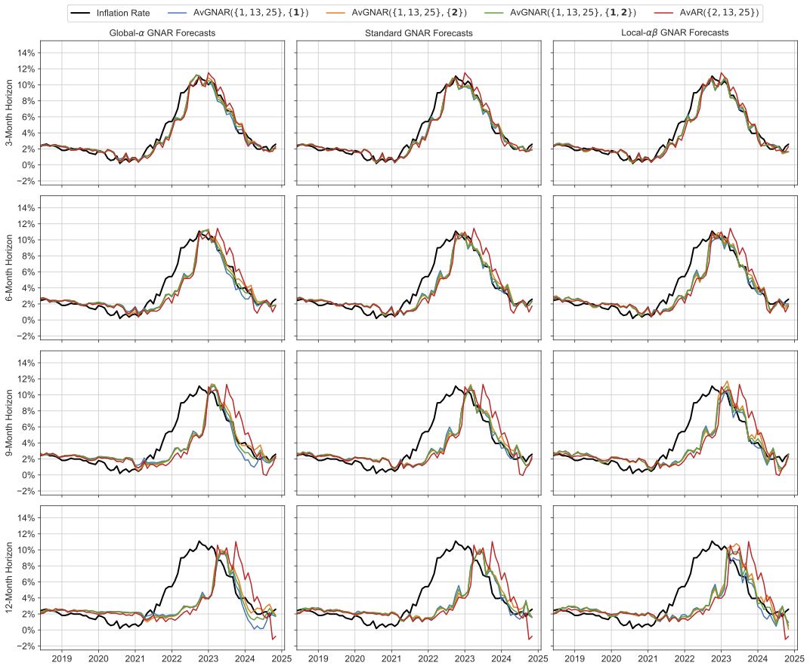

# RaGNAR: Forecasting UK Consumer Price Inflation with Random Generalised Network Autoregressive Processes

This repository contains the Python code used in our article:

**"Forecasting UK Consumer Price Inflation with RaGNAR: Random Generalised Network Autoregressive Processes"**  
*(Submitted to the **International Journal of Forecasting**).*

---

## Overview  
We forecast **monthly inflation in the United Kingdom** using **RaGNAR**, an ensemble of **Generalised Network Autoregressive (GNAR) processes** fitted to a set of **random networks** generated according to the **Erdős–Rényi–Gilbert model**. Nodes represent the **Consumer Price Index (CPI)** and its sub-components (*divisions, classes, and groups*).

---

## Data Source  
The CPI data is publicly available from the UK **Office for National Statistics (ONS)**:  
🔗 [ONS Consumer Price Indices Dataset](https://www.ons.gov.uk/economy/inflationandpriceindices/datasets/consumerpriceindices)  

For convenience, the script **`download_data.py`** (located in the **`methodology/`** folder) automatically **downloads and prepares the dataset**.

---

## Methodology  
1. Each month, the set of graphs is ranked according to the forecasting performance at the CPI node.  
2. The best-performing graphs are selected and used to forecast inflation.  
3. Multiple forecasts from different GNAR processes and graphs are averaged to produce robust inflation predictions. 

---

## Repository Structure
📂 Forecasting-Inflation-with-RaGNAR/
 ┣ 📂 methodology/     # Data, RaGNAR code, and example usage
 ┣ 📂 figures/         # Figures for forecasts and results
 ┣ 📜 README.md        # This file
 ┣ 📜 requirements.txt # Dependencies

---

## Example Usage

Below is a minimal example demonstrating how to use **RaGNAR** to forecast UK inflation with the **global** GNAR model class.

```python
import numpy as np
import pandas as pd
from random_graphs import generate_erdos_graphs, compute_ns_mats
from forecasting import forecast_networks, compute_avg_preds, compute_rmse_df
from scoring import cpi_rolling_se, cpi_rolling_mse

# Generate random network graphs
adj_mats = generate_erdos_graphs(10000, 112, 0.03)
ns_mats = compute_ns_mats(adj_mats, 2)

# Load CPI data
cpi_data = pd.read_csv("data/cpi_monthly_data.csv", index_col=0)
cpi_data.index = pd.to_datetime(cpi_data.index)
cpi_data = cpi_data.pct_change(12).dropna(how="all").bfill() * 100

# Set forecasting parameters
p_list = [1, 2, 12, 13, 25]

# Compute rolling squared errors and MSE
se_df = cpi_rolling_se(cpi_data, ns_mats, p_list, 2, start_date="2015-07-01", end_date="2024-11-01", n_train=150, n_shift=1)
mse_df = cpi_rolling_mse(se_df, 30)

# Generate forecasts using the global model
glo_preds = forecast_networks(mse_df, cpi_data, adj_mats, p_list, 2, model_type="global", n_train=150, n_test=1, start_date="2017-12-01", end_date="2024-12-01", h=12, n_best=5)

# Compute average predictions and RMSE
glo_avg = compute_avg_preds(glo_preds, 5)
glo_rmse = compute_rmse_df(glo_avg)
```

---

## Forecasting Results  

Below is an example of our inflation forecast obtained from a single run of RaGNAR.  
Forecasts are computed by averaging the predictions of the 5 best networks each month and GNAR models of different orders.   
The orders across which we average are contained within { } for each model.  
We compare our forecasts to those of an average of AR processes.  


