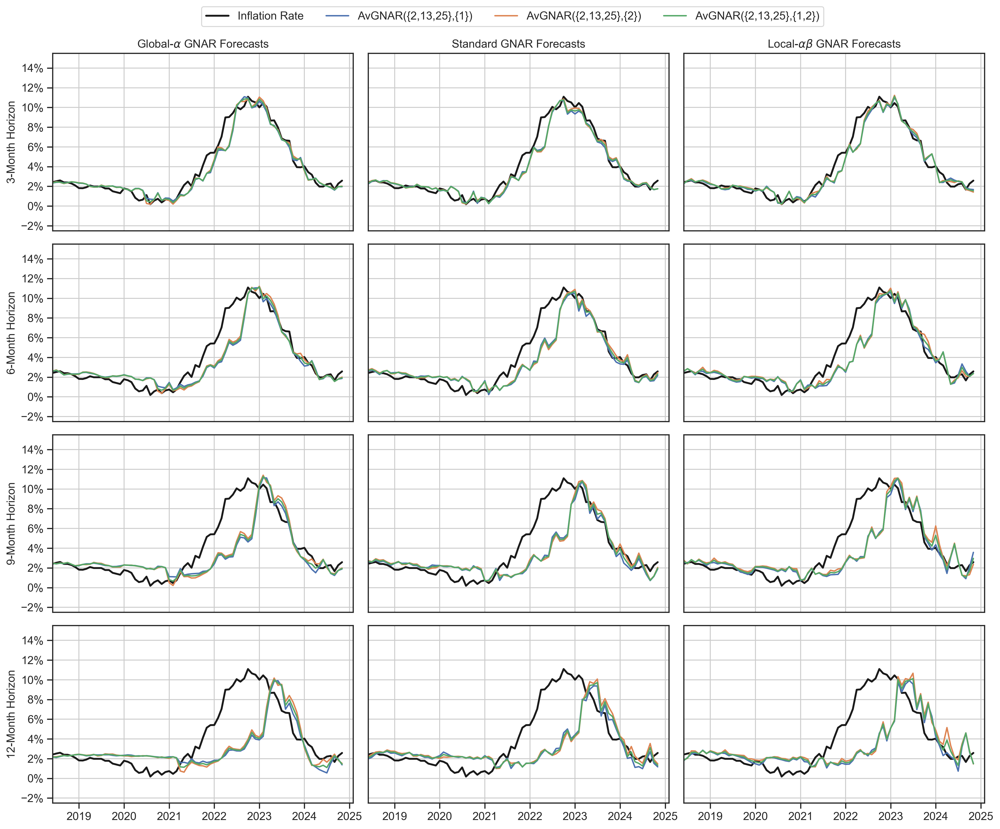

# Forecasting UK Consumer Price Inflation with RaGNAR: Random Generalised Network Autoregressive Processes

This repository contains the Python code used in our article:

📄 **"Forecasting UK Consumer Price Inflation with RaGNAR: Random Generalised Network Autoregressive Processes"**  
*(Submitted to the **International Journal of Forecasting**).*

---

## Overview  
We forecast **monthly inflation in the United Kingdom** using **RaGNAR**, an ensemble of **Generalised Network Autoregressive (GNAR) processes** fitted to a set of **random networks** generated according to the **Erdős–Rényi–Gilbert model**. Nodes represent the **Consumer Price Index (CPI)** and its sub-components (*divisions, classes, and groups*).

RaGNAR uses the **GNAR-Python** repository, an implementation of **GNAR models** in python:  
🔗 **[GNAR-Python Repository](https://github.com/henrypalasciano/GNAR-Python.git)**  

---

## Data Source  
The CPI data is publicly available from the UK **Office for National Statistics (ONS)**:  
🔗 [ONS Consumer Price Indices Dataset](https://www.ons.gov.uk/economy/inflationandpriceindices/datasets/consumerpriceindices)  

For convenience, the script **`download_data.py`** (located in the **`methodology/`** folder) automatically **downloads and prepares the dataset**.

---

## Methodology  
1. Each month, the set of graphs is ranked according to the forecasting performance at the CPI node.  
2. The best-performing graphs are selected and used to forecast inflation.  
3. Multiple forecasts from different GNAR processes and graphs are averaged to produce robust inflation predictions. 

---

## Repository Structure  

The repository is organised as follows:  

```plaintext
📂 Forecasting-Inflation-with-RaGNAR/
 ┣ 📂 methodology/     # Contains data, RaGNAR code, and example usage scripts
 ┣ 📂 figures/         # Stores figures generated during analysis
 ┣ 📂 results/         # Precomputed forecasts from various models for reproducibility
 ┣ 📜 README.md        # Project documentation and setup instructions
 ┣ 📜 requirements.txt # List of required dependencies for the project
 ┣ 📜 benchmarks.ipynb # Jupyter Notebook for forecasting with benchmark models
 ┣ 📜 chronos.ipynb    # Jupyter Notebook for forecasting using Chronos
 ┣ 📜 ragnar.ipynb     # Main Jupyter Notebook for forecasting with RaGNAR
```

The methodology folder is organised as follows:

```plaintext
📂 methodology/
 ┣ 📂 data/  
   ┣ 📜 BoE_forecasts.csv     # Bank of England forecasts (rows: dates, columns: horizons).  
   ┃                          # Data manually formatted from the BoE Monetary Policy Reports:  
   ┃                          # https://www.bankofengland.co.uk/monetary-policy-report/monetary-policy-report  
   ┣ 📜 cpi_data.csv          # File downloaded from the ONS Consumer Price Indices Dataset:  
   ┃                          # https://www.ons.gov.uk/economy/inflationandpriceindices/datasets/consumerpriceindices  
   ┣ 📜 cpi_dict.json         # Dictionary mapping CPI item series codes to names  
   ┣ 📜 cpi_monthly_data.csv  # Monthly CPI and disaggregated item series data (rows: dates, columns: series)  
 ┣ 📜 ar_forecasts.py         # Functions for forecasting AR processes  
 ┣ 📜 average_results.py      # Averages results from 100 RaGNAR runs (computed by parallel_comp.py)  
 ┃                             # and writes them to .txt files in the newly created average_results folder.
 ┣ 📜 bank_of_england.py      # Functions to compute RMSE and MAPE compared with the Bank of England forecasts  
 ┣ 📜 bic_gnar.py             # Functions for model selection using BIC and constructing forecasts  
 ┣ 📜 download_data.py        # Functions to download CPI data from ONS, format it, and save processed versions:  
   ┃                          # - `/data/cpi_data.csv`: Raw CPI data  
   ┃                          # - `/data/cpi_monthly_data.csv`: Monthly CPI time series  
   ┃                          # - `/data/cpi_dict.json`: Dictionary mapping CPI series codes to names  
 ┣ 📜 example.py              # Example script demonstrating a full run of RaGNAR  
 ┣ 📜 forecasting.py          # Functions to generate forecasts and compute RMSE and MAPE  
 ┣ 📜 parallel_comp.py        # Computes RMSEs across 100 RaGNAR runs and stores them in automatically created folders.
 ┣ 📜 plotting.py             # Functions to visualize forecasts in a grid format  
 ┣ 📜 random_graphs.py        # Functions to generate random graphs and compute neighbor set matrices  
 ┣ 📜 rw_forecasts.py         # Functions for forecasting RW (random walk) processes  
 ┣ 📜 scoring.py              # Functions to compute rolling one-step-ahead squared errors at the CPI node  
```

The `results/` folder contains forecasts from a **single run** of the RaGNAR algorithm for **reproducibility**.  
This run was carried out on a **2020 MacBook Pro with a 2.3 GHz Quad-Core Intel Core i7 processor**.  

The results are organized as follows:

```plaintext
📂 results/
 ┣ 📂 benchmarks/          # Forecasts from benchmark models
 ┣ 📂 ragnar/              # Forecasts from RaGNAR
   ┣ 📂 adj_mats/          # Stores 10,000 adjacency matrices
   ┣ 📂 avgnar/            # Forecasts computed by averaging GNAR processes of different orders
   ┣ 📂 se_df/             # Stores one-step ahead squared errors for all networks
   ┣ 📂 bic/               # Forecasts computed by selecting the best GNAR model each month using BIC
   ┣ 📂 network_avg/       # Forecasts computed by averaging across different networks
   ┣ 📜 global_preds.csv   # Predictions from the top 5 networks each month using the global model class
   ┣ 📜 local_preds.csv    # Predictions from the top 5 networks each month using the local model class
   ┣ 📜 standard_preds.csv # Predictions from the top 5 networks each month using the standard model class
```

---

## Parallel Computation  

The results presented in the article were computed by **averaging 100 runs of RaGNAR**.  

The `parallel_comp.py` script (located in the `methodology` folder) runs RaGNAR **100 times**, saving **RMSEs and MAPEs** for each run in dedicated folders.  
The `average_results.py` script then processes these stored results, computes their averages and standard deviations, and writes them to **various `.txt` files**.  

For the results in the article, the algorithm was executed **in parallel** on the [Maths NextGen Compute Cluster](https://sysnews.ma.ic.ac.uk/NextGen/) at the Department of Mathematics, Imperial College London.

---

## Example Usage

Below is a minimal example demonstrating how to use **RaGNAR** to forecast UK inflation with the **global** GNAR model class.

```python
import numpy as np
import pandas as pd
from random_graphs import generate_erdos_graphs, compute_ns_mats
from forecasting import forecast_networks, compute_avg_preds, compute_rmse_df
from scoring import cpi_rolling_se, cpi_rolling_mse

# Generate random network graphs
adj_mats = generate_erdos_graphs(10000, 112, 0.03)
ns_mats = compute_ns_mats(adj_mats, 2)

# Load CPI data
cpi_data = pd.read_csv("data/cpi_monthly_data.csv", index_col=0)
cpi_data.index = pd.to_datetime(cpi_data.index)
cpi_data = cpi_data.pct_change(12).dropna(how="all").bfill() * 100

# Set forecasting parameters
p_list = [1, 2, 12, 13, 25]

# Compute rolling squared errors and MSE
se_df = cpi_rolling_se(cpi_data, ns_mats, p_list, 2, start_date="2015-07-01", end_date="2024-11-01", n_train=150, n_shift=1)
mse_df = cpi_rolling_mse(se_df, 30)

# Generate forecasts using the global model
glo_preds = forecast_networks(mse_df, cpi_data, adj_mats, p_list, 2, model_type="global", n_train=150, n_test=1, start_date="2017-12-01", end_date="2024-12-01", h=12, n_best=5)

# Compute average predictions and RMSE
glo_avg = compute_avg_preds(glo_preds, 5)
glo_rmse = compute_rmse_df(glo_avg)
```

---

## Forecasting Results  

Below is an example of our inflation forecast obtained from a single run of RaGNAR. Forecasts are computed by averaging the predictions of the 5 best networks each month and GNAR models of different orders. The orders across which we average are contained within { } for each model. We compare our forecasts to those of an average of AR processes.  



---

## Contact  

**Guy P. Nason**  
📧 Email: [gnason@imperial.ac.uk](mailto:gnason@imperial.ac.uk)  

**Henry Antonio Palasciano**  
📧 Email: [henry.palasciano17@imperial.ac.uk](mailto:henry.palasciano17@imperial.ac.uk)
